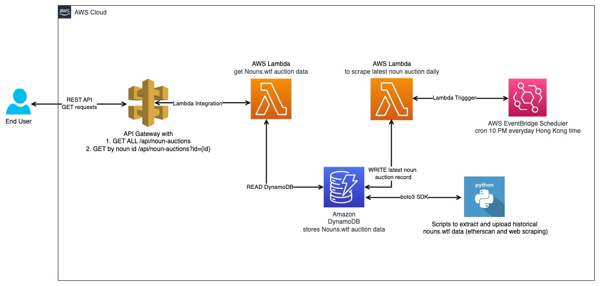

# Nouns-Api

Nouns-API provides APIs to GET Auction Data from Nouns.wtf, a very popular NFT project that has daily auctions of new automatically generated NFTs. The APIs help retrieve wallet address of the winner of auctions and their winning bid price.
It uses a serverless architecture


## API Reference

#### Get all auctions

```http
  GET /api/noun-auctions
```


#### Get auction with a particular noun id

```http
  GET /api/noun-auctions?id={id}
```

| Parameter | Type     | Description                       |
| :-------- | :------- | :-------------------------------- |
| `id`      | `int` | **Required**. Id of noun to fetch  |

## Accessing Live Endpoints

You can test the APIs at :

#### Get all auctions

https://t4ikzaj43h.execute-api.ap-southeast-1.amazonaws.com/api/noun-auctions


#### Get auction with a particular noun id

https://t4ikzaj43h.execute-api.ap-southeast-1.amazonaws.com/api/noun-auctions?id=2


## Data Collection and Cleaning

Nouns.wtf historical auction data is static data.

I obtained this data from Etherscan and scrapped Nouns.wtf for the missing data. 

For a small dataset like for this project we can just scrape but if there a hundreds of thousands of records data cleaning is more appropriate. 

There were some missing transactions and auctions information, so I scraped the auction data only for those which were missing.

### Etherscan Data

There is no single dataset with both Auction winner's wallet address and his bid price, since bids are placed first and auction concludes later. All Bids are made to auction house smart contract and it settles the auction by transferring the nft to the winner. I obtained the following two datasets.

- [Auction House Bid Data](https://etherscan.io/txs?a=0x830bd73e4184cef73443c15111a1df14e495c706)

This contains all the transactions that are made to auction house smart contract. We will use this to find out for how much did the auction winner bid.

- [Noun NFT Transfer Data](https://etherscan.io/token/0x9c8ff314c9bc7f6e59a9d9225fb22946427edc03)

This contains data about  Noun transfers. We know that if the auction house is transfering a Noun to a wallet. That wallet address has won the auction.

etherscan_data_cleanning.py joins both these data sets to produce a final data set. Join is is done on the winner wallet address, filtered according to date, and grouped by maximum bid value.

There was some missing transactions which resulted in null Bid value for certain record. For these records scrapping was done.


### Scrapping Missing Data

Nouns.wtf is a dynamic website where a lot of components are generated by javascript. Auction data, especially, takes some time to load.

scrape_missing_data.py script uses selenium which is a testing library used for automated testing. I stimulate a browzer enviornment and wait for the auction data to load before I can scrape it.

Selenium is also used in our lambda function scrapper script which successfully scrapes the latest auction data on a 24 hour cron basis and updates the Dynamo db. This enables us to have the latest data upto the previous auction always.


## Architecture



I chose serverless aws architecture because it can provide easy horizontal scaling. We can scale up or scale down more lambda functions, dynamo db table can be set to auto scale as well according to traffic. 

In future if we want to add some security features like requiring an API key for access, or requiring authorization using jwt token, it can be easily setup in API gateway.

## Setup and Deployment

To access the live APIs, check API Reference section.

Here, I briefly describe how I setup and deployed the APIs in AWS.

After collecting and cleaning the historical auction datain a scv file, I used my access keys, and insert_data_into_db.py script to insert all data in Dyanamo DB.

### Dynamo DB Setup

- I setup the Dynamo DB using noun_id as a partition key and provisioned it with auto scaling
- Since DynamoDB uses the partition key's value as input to an internal hash function, to decide which partition to store the item, retrieval using noun_id would be very quick.

### Lambda Functions Setup

- Lambda Function lambda_get_auctions.py which is triggered by API Gateway has read access policy to Dynamo DB and Full Access to CloudWatch for logging

- Lamda Function lambda_daily_noun_auction_scraping.py has write access to Dynamo DB and Full Access to CloudWatch for logging. It is triggered by Event Bridge daily and keeps the data in Dynamo DB updated. We need to add selenium package and chrome web driver as layers for this lambda, as these are external dependencies. 

### Event Bridge Setup

Set Up to trigger lambda_daily_noun_auction_scraping.py daily at 10PM HKT. 

### Amazon API Gateway

- We have a GET Method in noun-auctions resource
- id String parameter is kept optional
- Lambda checks if String Parameter is present or not and responds accordingly. That is, with full auction data if missing, otherwise with the auction data of the noun id provided


## Limitations

When retrieving all auctions data, we use Dyanamo DB's scan function. It is limited to 1MB or approximately 1000 items.

So when our data grows GET /api/noun-auctions might just return first 1000 entries.

The solution to this problem is to add pgination to the API, here the new APIs to Get all auctions will be:

```http
  GET /api/noun-auctions?page={page}&limit={limit}
```


| Parameter | Type     | Description                       |
| :-------- | :------- | :-------------------------------- |
| `page`      | `int` | **Required**. Page numer  |
| `limit`      | `int` | **Required**. Number of entries in a page  |
